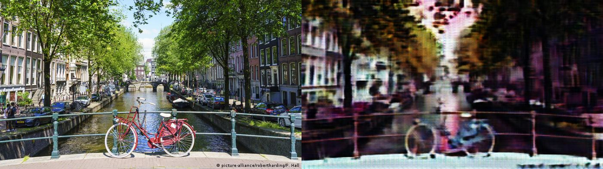

# CycleGAN

This is the unofficial implementation of Cycle GAN in Pytorch. The model was trained on sprites to produce pixel art. Here are some sample results

## Generated output





## Checkpoints
Pretrained checkpoints : [Drive link](https://drive.google.com/drive/folders/1PF9iVvaeCQwo_mWak0_FwOgYIcUtQbN7?usp=sharing)

Contains two type of checkpoints

| Type | Description |
| --- | --- |
| monet ckpt | Trained on monet2photo dataset | 
| new ckpt | Trained on pixel dataset | 

## Dataset

Monet2photo : [Kaggle](https://www.kaggle.com/balraj98/monet2photo)
Pixel : [Drive link](https://drive.google.com/file/d/1qDXB5g0Cb0VwISXwnfeiehPHuTgxWhdG/view)

## Train
Simply run
```
python3 train.py
```
## Inference
Inside the `config.py` file add the ckpt path and inside `inference.py` add input image path and output image path. Then run
```
python3 inference.py
```